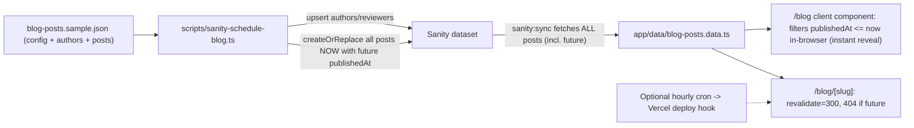

# Sanity 300-Post Scheduling + Maximal SEO

## Context & key facts (verified in repo)

- One thin schema [sanity/schemaTypes/post.ts](sanity/schemaTypes/post.ts): `title, slug, excerpt, publishedAt (date), readTime, tag, coverColor, content (markdown)`. No author/reviewer/SEO/cluster fields.
- Blog **pages render from static data** [app/data/blog-posts.data.ts](app/data/blog-posts.data.ts), generated by `npm run sanity:sync` ([scripts/sanity-sync-blog.ts](scripts/sanity-sync-blog.ts)). Pages do **not** query Sanity live; GROQ in [lib/blog/queries.ts](lib/blog/queries.ts) has **no `publishedAt <= now` filter**.
- Existing seed pattern to mirror: [scripts/sanity-seed-blog.ts](scripts/sanity-seed-blog.ts) (`createOrReplace`).
- No `sitemap.ts`, `robots.ts`, JSON-LD; minimal metadata in [app/blog/[slug]/page.tsx](app/blog/[slug]/page.tsx); [app/blog/page.tsx](app/blog/page.tsx) is a client component (cannot export metadata).
- 300 ideas (slug/title/intent/must-mentions, Tiers 1-4) in [docs/blogs-ideas.md](docs/blogs-ideas.md). Full written content will come from the JSON you supply.

## Scheduling decision (free tier - frontend date filtering)

No paid plan, no Content Releases, no Scheduled Drafts. Instead: the script **publishes every post immediately** (`createOrReplace`) but stamps each with a **future `publishedAt` datetime** computed from the staggered rollout. The frontend then **hides posts whose `publishedAt` is in the future** and reveals them automatically as the clock passes.

Why this fits this repo especially well:

- The blog **index** ([app/blog/page.tsx](app/blog/page.tsx)) is a **client component** rendering a static array. Filtering with `new Date(date) <= new Date()` runs in the visitor's browser at view time, so a post appears the **instant** its timestamp passes - no rebuild needed for the list.
- The blog **detail** route is SSG; we add `export const revalidate = 300` and return `notFound()` for not-yet-due posts, so direct hits to a future URL 404 until it regenerates after the scheduled time.
- An optional hourly redeploy (free cron -> deploy hook) is the belt-and-suspenders so SSG detail pages + sitemap refresh promptly.

Prerequisites (free):

- Sanity **free tier** is sufficient. Keep the existing `apiVersion: "2024-01-01"`.
- `sanity:sync` must include **all** posts (including future-dated) in the static data file so the client can reveal them over time. It already fetches all posts; we keep it that way (no `publishedAt <= now()` in the sync read query).
- Assumes **Vercel** hosting for the optional deploy-hook step; Netlify build-hook equivalent noted in the guide.

## Phase A - Schema extension (full SEO + E-E-A-T)

Edit [sanity/schemaTypes/post.ts](sanity/schemaTypes/post.ts):

- Change `publishedAt` from `date` to `datetime`.
- Add SEO fields: `seoTitle`, `metaDescription`, `focusKeyword`, `canonicalUrl` (url, optional), `ogImage` (image, hotspot), `noindex` (boolean, default false).
- Add structure fields: `tier` (number 1-4), `isPillar` (boolean), `pillar` (reference -> post), `clusterId` (string), `clusterTitle` (string).
- Add E-E-A-T refs: `author` (reference -> author, required), `medicalReviewer` (reference -> medicalReviewer, optional), `lastReviewedAt` (datetime).
  New document types: [sanity/schemaTypes/author.ts](sanity/schemaTypes/author.ts) (`name, slug, role, bio, credentials, avatar, links`) and [sanity/schemaTypes/medicalReviewer.ts](sanity/schemaTypes/medicalReviewer.ts) (`name, slug, title, credentials, bio, avatar`). Register all in [sanity/schemaTypes/index.ts](sanity/schemaTypes/index.ts).
- The `datetime` change on `publishedAt` is what makes time-of-day gating possible (current `date` type has no time component).

## Phase B - The scheduling script

New [scripts/sanity-schedule-blog.ts](scripts/sanity-schedule-blog.ts), added to [package.json](package.json) as `"sanity:schedule"`.

- Reads a JSON file path (arg, default sample), validates: unique slugs, required fields, `pillarSlug`/`authorKey`/`medicalReviewerKey` resolve, valid tier.
- Upserts `author` + `medicalReviewer` docs (`createOrReplace` by deterministic `_id`).
- Computes each post's future `publishedAt` from `config` + post metadata when not explicitly set:
    - Phase 1 (Week 1): `tier === 1` / `isPillar` -> startDate week.
    - Phase 2 (Weeks 2-6): "200 backfill" -> weekly batches of `config.backfillPerWeek` (~35).
    - Phase 3 (Months 2-7): remaining -> `config.staggerPerWeek` (4-5/wk).
    - Converts `config.publishTime` in `config.timezone` to a stored **UTC ISO `...Z`** datetime (so `now()`/browser comparison is unambiguous). No backdating - all dates are >= run date.
- Writes **all** posts in a single `client.transaction()` of `createOrReplace` (same pattern as [scripts/sanity-seed-blog.ts](scripts/sanity-seed-blog.ts)) with `_id: post-<slug>`, full SEO fields, and references to author/reviewer/pillar. Posts are published immediately; visibility is governed purely by the future `publishedAt`.
- Flags: `--dry-run` (prints the computed schedule table, no writes - the safe default test), `--file <path>`, `--limit <n>`.

## Phase C - Frontend data plumbing + date gating

- [app/data/blog-types.ts](app/data/blog-types.ts): extend `BlogPost` with seo/author/reviewer/cluster/pillar fields.
- [app/data/blog-posts.ts](app/data/blog-posts.ts): add gating helpers - `isPublished(date)` (`new Date(date) <= new Date()`), `getPublishedPosts()`, and make `getPostBySlug`/`getRelatedPosts` published-aware. This is the core of the free reveal mechanism.
- [lib/blog/queries.ts](lib/blog/queries.ts): keep the **sync read query unfiltered** (so future posts land in the static file). For the **live API routes** add a `&& publishedAt <= now()` variant. Expand GROQ to dereference `author`/`medicalReviewer`/`pillar` and project new fields; add a "cluster posts for a pillar" query.
- [lib/blog/map-post.ts](lib/blog/map-post.ts): map new fields.
- `npm run sanity:sync` continues to write **all** posts (incl. future-dated) into [app/data/blog-posts.data.ts](app/data/blog-posts.data.ts); re-run sync only when adding new content, not for reveal.

## Phase D - Technical SEO implementation

- New [app/sitemap.ts](app/sitemap.ts): emit `/`, `/blog`, and every **published** `/blog/[slug]` (exclude future-dated via `isPublished`) with `lastmod` = `lastReviewedAt || publishedAt`; uses `NEXT_PUBLIC_SITE_URL`.
- New [app/robots.ts](app/robots.ts): allow crawl, reference sitemap.
- [app/layout.tsx](app/layout.tsx): add `metadataBase`.
- [app/blog/[slug]/page.tsx](app/blog/[slug]/page.tsx): add `export const revalidate = 300`; **return `notFound()` for not-yet-due posts** so future URLs 404 until their time; `generateStaticParams` builds only published slugs. Rich `generateMetadata` (title/description from `seoTitle`/`metaDescription`, canonical, OpenGraph article + `ogImage`, Twitter card, `robots.noindex`); inject JSON-LD (`Article`/`MedicalWebPage` with author, `datePublished`, `dateModified`, `reviewedBy`, publisher) + `BreadcrumbList`; render author bio + "Medically reviewed by" block (E-E-A-T); render bidirectional internal links (pillar lists its cluster posts; cluster posts link back to pillar via keyword anchor).
- [app/blog/page.tsx](app/blog/page.tsx): keep the client UI but render `getPublishedPosts()` so future posts are hidden and revealed live in-browser; split a thin server wrapper to export metadata + `CollectionPage`/`Blog` JSON-LD.

## Phase E - Sample JSON + test

New [data/blog-posts.sample.json](data/blog-posts.sample.json): `config` (startDate, publishTime, timezone, backfillPerWeek, staggerPerWeek), `authors`, `medicalReviewers`, and ~8 `posts` spanning Tiers 1-4 across 2 clusters (>=1 pillar with reviewer + its cluster posts). This is the exact structure you'll replicate with the real 300.

- Test: `npm run sanity:schedule -- --dry-run` to validate parsing + print the computed schedule with zero writes. A live run additionally needs `SANITY_*` env (free tier is fine); then `npm run sanity:sync` to pull all posts into the static file. Documented in the guide.

## Phase F - The markdown guide

New [docs/blog-scheduling-and-seo.md](docs/blog-scheduling-and-seo.md) covering: prerequisites (free tier, env vars); JSON schema reference + field meanings; how to run dry-run vs live + `sanity:sync`; **how the free reveal works** (future `publishedAt` + client-side filter + ISR `revalidate=300` + future-post 404) and the optional hourly redeploy (Vercel deploy hook via free cron such as cron-job.org / GitHub Actions; Netlify equivalent); the rollout calendar (Week 0 architecture, Week 1 pillars, Weeks 2-6 backfill, Months 2-7 stagger) with no backdating; topic-cluster/pillar mapping; the full **manual SEO checklist** (GSC + Bing setup, sitemap submission, robots reference, per-post on-page checklist, content-quality/E-E-A-T rules, mobile/Core Web Vitals, backlink + monitoring cadence).

## Env / config additions

- [.env.example](.env.example): document prod `NEXT_PUBLIC_SITE_URL` and optional `SANITY_DEPLOY_HOOK_URL` (only for the optional hourly redeploy). No apiVersion bump needed.

## Out of scope (flagged as follow-ups)

- Writing the actual 300 posts' content (you supply via JSON).
- Separate cluster landing-page routes (clusters handled via pillar posts + references).
- Paid Content Releases / true server-side scheduled publishing (intentionally avoided to stay on the free tier).
