# Sanity 300-Post Scheduling + Maximal SEO

## Context & key facts (verified in repo)

- One thin schema [sanity/schemaTypes/post.ts](sanity/schemaTypes/post.ts): `title, slug, excerpt, publishedAt (date), readTime, tag, coverColor, content (markdown)`. No author/reviewer/SEO/cluster fields.
- Blog **pages render from static data** [app/data/blog-posts.data.ts](app/data/blog-posts.data.ts), generated by `npm run sanity:sync` ([scripts/sanity-sync-blog.ts](scripts/sanity-sync-blog.ts)). Pages do **not** query Sanity live; GROQ in [lib/blog/queries.ts](lib/blog/queries.ts) has **no `publishedAt <= now` filter**.
- Existing seed pattern to mirror: [scripts/sanity-seed-blog.ts](scripts/sanity-seed-blog.ts) (`createOrReplace`).
- No `sitemap.ts`, `robots.ts`, JSON-LD; minimal metadata in [app/blog/[slug]/page.tsx](app/blog/[slug]/page.tsx); [app/blog/page.tsx](app/blog/page.tsx) is a client component (cannot export metadata).
- 300 ideas (slug/title/intent/must-mentions, Tiers 1-4) in [docs/blogs-ideas.md](docs/blogs-ideas.md). Full written content will come from the JSON you supply.

## Scheduling decision (modern equivalent of your choice)

The standalone Scheduled Publishing plugin is **deprecated**; we use **Scheduled Drafts via Content Releases + Actions API** (`@sanity/client` helpers `client.releases.create()`, `client.createVersion()`, `client.releases.schedule()`). Documents are created as drafts/versions and **auto-publish inside Sanity** at the scheduled time. The script groups posts that publish on the same date into one scheduled **release** (one release per batch), which maps cleanly to the "publish in batches, not all at once" strategy.

Prerequisites (called out in the guide):

- Sanity project on a **paid plan** (Content Releases = Growth+).
- Script client uses `apiVersion: "2025-02-19"` (overrides the repo default `2024-01-01`).
- A **rebuild/webhook loop** so the static site reflects newly-published posts.

```mermaid
flowchart LR
  JSON["blog-posts.sample.json (config + authors + posts)"] --> Script["scripts/sanity-schedule-blog.ts"]
  Script -->|"upsert authors/reviewers"| Sanity["Sanity dataset"]
  Script -->|"create release per batch + version docs + schedule(publishAt)"| Sanity
  Sanity -->|"auto-publish at executeAt (UTC)"| Published["Published posts"]
  Published -->|"GROQ webhook on publish"| Hook["Vercel Deploy Hook"]
  Hook --> Build["next build (prebuild runs sanity:sync)"]
  Build --> Static["app/data/blog-posts.data.ts -> live site + sitemap"]
```

## Phase A - Schema extension (full SEO + E-E-A-T)

Edit [sanity/schemaTypes/post.ts](sanity/schemaTypes/post.ts):

- Change `publishedAt` from `date` to `datetime`.
- Add SEO fields: `seoTitle`, `metaDescription`, `focusKeyword`, `canonicalUrl` (url, optional), `ogImage` (image, hotspot), `noindex` (boolean, default false).
- Add structure fields: `tier` (number 1-4), `isPillar` (boolean), `pillar` (reference -> post), `clusterId` (string), `clusterTitle` (string).
- Add E-E-A-T refs: `author` (reference -> author, required), `medicalReviewer` (reference -> medicalReviewer, optional), `lastReviewedAt` (datetime).
  New document types: [sanity/schemaTypes/author.ts](sanity/schemaTypes/author.ts) (`name, slug, role, bio, credentials, avatar, links`) and [sanity/schemaTypes/medicalReviewer.ts](sanity/schemaTypes/medicalReviewer.ts) (`name, slug, title, credentials, bio, avatar`). Register all in [sanity/schemaTypes/index.ts](sanity/schemaTypes/index.ts).
- Optional Studio upgrade note: in-Studio management of scheduled drafts needs Studio v4.14+; programmatic scheduling works on current v3.99 without upgrade.

## Phase B - The scheduling script

New [scripts/sanity-schedule-blog.ts](scripts/sanity-schedule-blog.ts), added to [package.json](package.json) as `"sanity:schedule"`.

- Reads a JSON file path (arg, default sample), validates: unique slugs, required fields, `pillarSlug`/`authorKey`/`medicalReviewerKey` resolve, valid tier.
- Upserts `author` + `medicalReviewer` docs (createOrReplace by deterministic `_id`).
- Computes each post's `publishAt` from `config` + post metadata when not explicitly set:
    - Phase 1 (Week 1): `tier === 1` / `isPillar` -> startDate week.
    - Phase 2 (Weeks 2-6): "200 backfill" -> weekly batches of `config.backfillPerWeek` (~35).
    - Phase 3 (Months 2-7): remaining -> `config.staggerPerWeek` (4-5/wk).
    - Converts `config.publishTime` in `config.timezone` to **UTC `...Z`** (required by the API).
- Groups posts by resolved publish datetime; per group: `releases.create({releaseType:'scheduled', metadata:{title, intendedPublishAt}})`, `createVersion()` for each post (with full SEO fields + refs), then `releases.schedule({releaseId, publishAt})`.
- Flags: `--dry-run` (prints schedule table, no writes - the safe default test), `--file <path>`, `--limit <n>`.

## Phase C - Frontend data plumbing

- [app/data/blog-types.ts](app/data/blog-types.ts): extend `BlogPost` with seo/author/reviewer/cluster/pillar fields.
- [lib/blog/queries.ts](lib/blog/queries.ts): expand GROQ to dereference `author`/`medicalReviewer`/`pillar` and project new fields; add `&& publishedAt <= now()` guard (defense in depth; releases already gate publish). Add a "cluster posts for a pillar" query.
- [lib/blog/map-post.ts](lib/blog/map-post.ts): map new fields.
- Ensure `npm run sanity:sync` regenerates static data with new fields; wire `prebuild` (or `build`) to run `sanity:sync` so deploys pick up newly-published posts.

## Phase D - Technical SEO implementation

- New [app/sitemap.ts](app/sitemap.ts): emit `/`, `/blog`, and every `/blog/[slug]` with `lastmod` = `lastReviewedAt || publishedAt`; uses `NEXT_PUBLIC_SITE_URL`.
- New [app/robots.ts](app/robots.ts): allow crawl, reference sitemap.
- [app/layout.tsx](app/layout.tsx): add `metadataBase`.
- [app/blog/[slug]/page.tsx](app/blog/[slug]/page.tsx): rich `generateMetadata` (title/description from `seoTitle`/`metaDescription`, canonical, OpenGraph article + `ogImage`, Twitter card, `robots.noindex`); inject JSON-LD (`Article`/`MedicalWebPage` with author, `datePublished`, `dateModified`, `reviewedBy`, publisher) + `BreadcrumbList`; render author bio + "Medically reviewed by" block (E-E-A-T); render bidirectional internal links (pillar lists its cluster posts; cluster posts link back to pillar via keyword anchor).
- [app/blog/page.tsx](app/blog/page.tsx): split a server wrapper to export metadata + `CollectionPage`/`Blog` JSON-LD while keeping the interactive client UI.

## Phase E - Sample JSON + test

New [data/blog-posts.sample.json](data/blog-posts.sample.json): `config` (startDate, publishTime, timezone, backfillPerWeek, staggerPerWeek), `authors`, `medicalReviewers`, and ~8 `posts` spanning Tiers 1-4 across 2 clusters (>=1 pillar with reviewer + its cluster posts). This is the exact structure you'll replicate with the real 300.

- Test: `npm run sanity:schedule -- --dry-run` to validate parsing + print the computed schedule with zero writes. A live run additionally needs `SANITY_*` env + paid plan; documented in the guide.

## Phase F - The markdown guide

New [docs/blog-scheduling-and-seo.md](docs/blog-scheduling-and-seo.md) covering: prerequisites (paid plan, env vars, deploy hook); JSON schema reference + field meanings; how to run dry-run vs live; the rollout calendar (Week 0 architecture, Week 1 pillars, Weeks 2-6 backfill, Months 2-7 stagger) with no backdating; topic-cluster/pillar mapping; the full **manual SEO checklist** (GSC + Bing setup, sitemap submission, robots reference, per-post on-page checklist, content-quality/E-E-A-T rules, mobile/Core Web Vitals, backlink + monitoring cadence); and the publish->webhook->deploy->sync rebuild loop setup.

## Env / config additions

- [.env.example](.env.example): document `SANITY_API_VERSION="2025-02-19"` for scheduling, prod `NEXT_PUBLIC_SITE_URL`, and `SANITY_DEPLOY_HOOK_URL` (used only in the guide for the webhook loop).

## Out of scope (flagged as follow-ups)

- Writing the actual 300 posts' content (you supply via JSON).
- Separate cluster landing-page routes (clusters handled via pillar posts + references).
- Migrating blog pages from static-sync to live ISR rendering.
