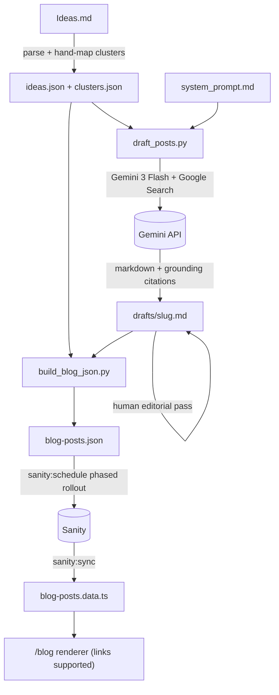

# Blog post schema explanation

Goal
Author 300 posts the right way (topical clusters, bidirectional linking, phased non-backdated rollout) with a Gemini 3 Flash drafter that focuses only on content; the script deterministically fills the JSON schema and reuses the existing Sanity scheduler.
Architecture decisions (confirmed)

Renderer extended to support clickable links + a Sources section.
Two-stage: drafter writes Markdown to disk for human edit; a separate assembler builds JSON.
Model:gemini-3-flash(configurable via env).
New location
All pipeline code lives in accelerate-health-posts/pipeline/ (Python), keeping it next to blog-posts.sample.json and Ideas.md. Site renderer change is in aspargolabs-demo.

Phase 0 — Topic architecture (source of truth for relationships)
Build two config files so linking/scheduling are deterministic and the drafter never invents structure.

pipeline/clusters.json(hand-authored, ~8–12 entries). Per cluster:clusterId,clusterTitle,pillarSlug,tag,coverColor,authorKey,medicalReviewerKey. Derived from the Cluster A–O groupings inIdeas.mdand pillar slugs in Tier 1.
pipeline/ideas.json— one object per post matching the brief spec already sketched at the end ofIdeas.md(lines 1078–1094):slug,title,tier,clusterId,pillarSlug,intent,target*keywords[],must_mention[],hezkue_mention_type,medical_review_required,cta_text,cta_link,focusKeyword.
pipeline/parse_ideas.py— parses the Markdown briefs inIdeas.mdinto a first draft ofideas.json(regex on the\*\*T*-NNN**/- **Slug:**/- **Must mention:\*\*structure). Output is then human-completed for terse Tier 3/4 entries.
Linking targets are computed by the script (not the model), per the rules in Ideas.md lines 1065–1068:

T1 pillar: links to its cluster's child posts (handled by existing "In this guide" box) + 1–2 sibling pillars.
T2: 1 cornerstone (itspillarSlug) + 1–2 adjacent same-cluster posts.
T3/T4: ≥2 cornerstones (its pillar +complete-guide-erectile-dysfunction).

Phase 1 — Drafter agent (pipeline/draft_posts.py)

SDK:google-genai(from google import genai),tools=[types.Tool(google_search=types.GoogleSearch())],model=GEMINI_MODEL(defaultgemini-3-flash).
System prompt inpipeline/prompts/system_prompt.mdcovering: who Accelerate Health / HEZKUE are; E-E-A-T and YMYL expectations;length by tier(T1 2000–4000, T2 800–1500, T3 500–800, T4 ~600–1000 words); allowed Markdown only (##,###,-,1.,>,**bold**,[text](url)); mandatory use of the search tool with 3–6 authoritative inline citations (.gov/.edu/journals/medical orgs) + a final## Sourceslist; Hezkue CTA placement/language (Ideas.md lines 1070–1075); medical disclaimer on YMYL; no keyword stuffing; and the rule that internal links must use ONLY the provided allowlist (exact URL/blog/<slug>+ suggested anchor text).
Per-post user prompt built deterministically from theideas.jsonbrief + computed internal-link allowlist + focus keyword.
For each idea, one at a time: call Gemini, read text, extractresponse.candidates[0].grounding_metadata(grounding_chunksuri/title) for logging/verification. Prefer the publisher URLs the model wrote inline over the grounding redirect URLs.
Writepipeline/drafts/<slug>.mdwith YAML front matter (slug,tier,word_count,model,generated_at,citations[],status: draft) + the Markdown body.
Resumable (skip slugs already drafted unless--force),--only <slug>,--tier N,--limit N; retries viatenacity; logs token + search usage.
Phase 1.5 — Human editorial pass
Editors review/edit pipeline/drafts/\*.md in place and flip front-matter status: reviewed. The assembler can require status: reviewed (via --require-reviewed) to enforce the non-negotiable human pass.

Phase 2 — Assembler (pipeline/build_blog_json.py)
Deterministically produces accelerate-health-posts/blog-posts.json matching BlogPostsJson in types.ts:

config(startDate/publishTime/timezone/backfillPerWeek/staggerPerWeek),authors,medicalReviewers(carried from a smallpipeline/authors.jsonor the existing sample).
For each reviewed draft, build the post object:slug,title,excerpt,readTime(computedround(words/200)+ " min read"),tag/coverColor(from cluster),tier,isPillar(tier 1),pillarSlug,clusterId/clusterTitle,authorKey/medicalReviewerKey,seoTitle/metaDescription/focusKeyword,content(reviewed Markdown),lastReviewedAt.
Validation: every/blog/<slug>link in content must resolve to a known slug and be in that post's allowlist; warn on missing Sources section, over/under length, missing CTA (non-T1), missing medical disclaimer on YMYL. Mirrors checks invalidate.ts.

Phase 3 — Site renderer: support links (+ optional tables)
Edit renderInlineFormatting in aspargolabs-demo/app/blog/[slug]/page.tsx (currently only handles **bold**) to also parse [text](url):

Internal (/blog/...or relative): render Next<Link>, normal follow.
External (http):<a target="_blank" rel="noopener noreferrer">(no nofollow — citations should pass authority).
The existing## +- handling already renders a## Sourceslist once links work; no new component required.
Optional: add Markdown table support (theed-causes-by-agesample currently has a table that renders as raw text) — flagged as nice-to-have.

Phase 4 — Seed + phased schedule (reuse existing infra)
No new scheduling code. From aspargolabs-demo/:

Dry run:npm run sanity:schedule -- --dry-run --file ../accelerate-health-posts/blog-posts.json(prints the Week-1 pillars / Weeks 2–6 backfill / Months 2–7 stagger table; errors ifconfig.startDatewould backdate).
Live: add--live.
npm run sanity:syncto regenerateblog-posts.data.ts.
Ordering/links: the schedule script upserts authors, reviewers, and all posts in one transaction; thepillarreference (post-<pillarSlug>) and in-content/blog/<slug>links resolve regardless of seed order, so no manual ordering is needed.

Deliverables / dependencies

pipeline/requirements.txt:google-genai,python-frontmatter,pyyaml,python-dotenv,tenacity.
pipeline/.env.example:GEMINI_API_KEY,GEMINI_MODEL=gemini-3-flash.
pipeline/README.md: runbook (Phase 0 → draft → review → assemble → dry-run → live → sync) mapped to the Week 0 / Week 1 / Weeks 2–6 / Months 2–7 timeline.
Notes / caveats

Outbound citations are E-E-A-T/authority signals, not inbound backlinks; they make posts stronger linkable assets but real backlinks still require outreach.
Groundinguris are Google redirect links — use inline publisher URLs for display; keep grounding metadata for audit.
Gemini Search grounding is a paid-tier feature; budget per grounded query.

_Exported on 6/21/2026 at 16:26:16 GMT+5:30 from Cursor (3.7.42)_

---

**User**

@accelerate-health-posts/blog-posts.sample.json explain the schema of blog posts and how it fits into the blog section of accelerate health

@aspargolabs-demo

we have a seed script to push the posts to sanity

my job is writing all the blog posts in the json format - so i need to understand how to do this

---

**Cursor**

I'll trace the blog post JSON schema, the Sanity seed script, and how they connect in the Accelerate Health blog.

# Blog post JSON schema and how it fits Accelerate Health

Your working file (`accelerate-health-posts/blog-posts.sample.json`) matches the format the **aspargolabs-demo** site expects. That repo is the Accelerate Health demo site; the blog lives at `/blog` (“From the Lab”) and is backed by Sanity CMS.

There are **two seed paths** — you want the JSON one:

| Script                        | Source                                      | Use case                                        |
| ----------------------------- | ------------------------------------------- | ----------------------------------------------- |
| `npm run sanity:seed`         | Hardcoded posts in `lib/blog/seed-posts.ts` | Quick dev bootstrap (~5 posts, no scheduling)   |
| **`npm run sanity:schedule`** | **Your JSON file**                          | Full 300-post rollout with dates, SEO, clusters |

Your job is writing for **`sanity:schedule`**.

---

## End-to-end flow

```text
blog-posts.json (you write this)
        ↓
npm run sanity:schedule -- --dry-run     ← validate + preview dates
npm run sanity:schedule -- --live --file path/to/blog-posts.json
        ↓
Sanity CMS (authors, reviewers, posts with future publishedAt)
        ↓
npm run sanity:sync
        ↓
app/data/blog-posts.data.ts (auto-generated)
        ↓
Site: /blog index + /blog/[slug] detail pages
```

Posts with a **future** `publishedAt` are stored in Sanity but **hidden** on the site until that datetime passes. No paid Sanity scheduling plan needed.

---

## Top-level JSON structure

Your file has four sections:

### 1. `config` — rollout calendar (not per-post)

Controls **when** posts publish. You set this once; individual posts usually do **not** get a date.

| Field             | Meaning                                                                       |
| ----------------- | ----------------------------------------------------------------------------- |
| `startDate`       | Week 1 anchor (`YYYY-MM-DD`). Must be today or later when you run the script. |
| `publishTime`     | Local time each day, e.g. `"09:00"`                                           |
| `timezone`        | IANA zone, e.g. `"America/New_York"`                                          |
| `backfillPerWeek` | Tier 2–3 posts per week (weeks 2–6)                                           |
| `staggerPerWeek`  | Tier 4 posts per week (months 2–7)                                            |

The scheduler (`lib/blog/schedule/compute-dates.ts`) assigns dates by tier:

- **Tier 1 / `isPillar: true`** → week of `startDate`
- **Tier 2–3** → weeks 2–6, batched by `backfillPerWeek`
- **Tier 4** → from week 7 onward, `staggerPerWeek`
- **`publishedAt` on a post** → overrides auto-schedule for that post only

### 2. `authors` — reusable author profiles

```json
{
	"key": "clinical",
	"name": "Dr. James Rothwell",
	"slug": "dr-james-rothwell",
	"role": "Medical Writer",
	"bio": "...",
	"credentials": "MD, MPH"
}
```

Posts reference authors via **`authorKey`**, not inline author objects. Keys must be unique.

### 3. `medicalReviewers` — same pattern

```json
{
	"key": "urology",
	"name": "Dr. Elena Vasquez",
	"slug": "dr-elena-vasquez",
	"title": "Board-Certified Urologist",
	"credentials": "MD, FACS",
	"bio": "..."
}
```

Referenced from posts via **`medicalReviewerKey`**. Strongly recommended for Tier 1 (YMYL pillar content).

### 4. `posts` — the articles you write

---

## Post object: field-by-field

### Required on every post

| Field        | Example                                  | Notes                                                                          |
| ------------ | ---------------------------------------- | ------------------------------------------------------------------------------ |
| `slug`       | `"ed-causes-by-age-20s-30s-40s-50s-60s"` | URL: `/blog/{slug}`. Unique, kebab-case.                                       |
| `title`      | Full headline                            | Shown as H1 on the page.                                                       |
| `excerpt`    | 1–2 sentence summary                     | Shown under title; fallback for SEO if no `metaDescription`.                   |
| `readTime`   | `"8 min read"`                           | Display only.                                                                  |
| `tag`        | `"Science"`                              | Category badge. Samples use: Guide, Science, Wellness, FAQ, Product, Industry. |
| `coverColor` | `"from-teal/20 to-void"`                 | Tailwind gradient classes for the hero placeholder.                            |
| `content`    | Markdown string                          | Body (see markdown rules below).                                               |
| `authorKey`  | `"clinical"`                             | Must match an author `key`.                                                    |

### SEO (strongly recommended)

| Field             | Notes                                                      |
| ----------------- | ---------------------------------------------------------- |
| `seoTitle`        | `<title>` tag; aim under ~60 chars. Falls back to `title`. |
| `metaDescription` | 150–160 chars for search snippets.                         |
| `focusKeyword`    | Used in pillar link anchor text and SEO strategy.          |
| `canonicalUrl`    | Optional override.                                         |
| `noindex`         | Optional `true` to exclude from indexing.                  |

### Topic clusters (for the 300-post strategy)

| Field          | When to use                                               |
| -------------- | --------------------------------------------------------- |
| `tier`         | `1`–`4` — drives publish schedule and content quality bar |
| `isPillar`     | `true` on cornerstone pages (usually tier 1)              |
| `pillarSlug`   | On cluster posts — slug of the parent pillar              |
| `clusterId`    | Group ID, e.g. `"ed-guide"`                               |
| `clusterTitle` | Display name, e.g. `"Erectile Dysfunction Guide"`         |

**Cluster example from your sample:**

```text
Cluster: ed-guide
  Pillar: complete-guide-erectile-dysfunction (tier 1, isPillar: true)
  ├── ed-causes-by-age-... (tier 2, pillarSlug → pillar)
  ├── psychological-erectile-dysfunction-guide (tier 2)
  └── erectile-dysfunction-diabetes (tier 2)
```

On the site:

- Cluster posts show a **“Part of: {clusterTitle}”** box linking to the pillar.
- Pillar posts show an **“In this guide”** list of published cluster posts.
- Related sidebar prefers same cluster.

### Optional overrides

| Field            | Notes                                              |
| ---------------- | -------------------------------------------------- |
| `publishedAt`    | ISO datetime — skips auto-scheduling for this post |
| `lastReviewedAt` | For content refresh tracking in Sanity             |

---

## Minimal post template

**Pillar (Tier 1):**

```json
{
	"slug": "complete-guide-erectile-dysfunction",
	"title": "The Complete Guide to Erectile Dysfunction...",
	"excerpt": "A comprehensive, evidence-based overview...",
	"readTime": "12 min read",
	"tag": "Guide",
	"coverColor": "from-teal/20 to-void",
	"tier": 1,
	"isPillar": true,
	"clusterId": "ed-guide",
	"clusterTitle": "Erectile Dysfunction Guide",
	"authorKey": "clinical",
	"medicalReviewerKey": "urology",
	"seoTitle": "Erectile Dysfunction Guide 2026: Causes, Treatments & What Works",
	"metaDescription": "Learn what causes erectile dysfunction...",
	"focusKeyword": "erectile dysfunction guide",
	"content": "## What Is Erectile Dysfunction?\n\nBody paragraph...\n\n### Subsection\n\n- **Bold bullet**\n\n> Blockquote for emphasis."
}
```

**Cluster post (Tier 2):**

```json
{
	"slug": "ed-causes-by-age-20s-30s-40s-50s-60s",
	"title": "...",
	"excerpt": "...",
	"readTime": "8 min read",
	"tag": "Science",
	"coverColor": "from-teal/15 to-void",
	"tier": 2,
	"pillarSlug": "complete-guide-erectile-dysfunction",
	"clusterId": "ed-guide",
	"clusterTitle": "Erectile Dysfunction Guide",
	"authorKey": "clinical",
	"medicalReviewerKey": "urology",
	"focusKeyword": "erectile dysfunction by age",
	"metaDescription": "...",
	"content": "..."
}
```

**Standalone / Tier 4** (no cluster):

Omit `pillarSlug`, `clusterId`, `clusterTitle`, and `isPillar`. Your sample `"ed-medication-myths-debunked"` is tier 4 with no cluster fields.

---

## `content`: markdown rules (important)

Content is a **JSON string** with `\n` for line breaks (not multiline template literals).

The site renderer (`app/blog/[slug]/page.tsx`) supports:

| Syntax                  | Renders as               |
| ----------------------- | ------------------------ |
| `## Heading`            | H2                       |
| `### Heading`           | H3                       |
| `- item`                | Bullet list              |
| `1. item` / `2.` / `3.` | Numbered list (only 1–3) |
| `> quote`               | Blockquote               |
| `**text**`              | Bold                     |
| Blank line              | Paragraph break          |

**Not supported today:**

- Markdown **tables** (your sample has one in `ed-causes-by-age-...` — it will not render as a table)
- `####` and deeper headings
- `[links](url)` — links appear as plain text unless you add HTML (avoid)
- Images in markdown

For comparisons, use bullets or numbered lists instead of tables.

---

## Validation before import

`sanity:schedule` runs `validateBlogPostsJson` and will fail on:

- Missing required fields
- Duplicate `slug` or author/reviewer `key`
- Unknown `authorKey` / `medicalReviewerKey`
- Unknown `pillarSlug`
- `tier` outside 1–4
- Auto-computed dates in the past (`startDate` too early)

**Always dry-run first:**

```bash
cd aspargolabs-demo
npm run sanity:schedule -- --dry-run --file ../accelerate-health-posts/blog-posts.json
```

Use `--limit 3` to test a small batch.

---

## How fields map to the live blog

| JSON field                          | Sanity field          | On-site use                                |
| ----------------------------------- | --------------------- | ------------------------------------------ |
| (computed)                          | `publishedAt`         | Date on card + article; gating visibility  |
| `title`, `excerpt`, `content`, etc. | same                  | Article body and header                    |
| `authorKey`                         | `author` ref          | Byline + “About the author”                |
| `medicalReviewerKey`                | `medicalReviewer` ref | “Medically reviewed by…”                   |
| `pillarSlug`                        | `pillar` ref          | “Part of” box + cluster nav                |
| `seoTitle`, `metaDescription`, etc. | same                  | Meta tags + JSON-LD (`lib/blog/seo.ts`)    |
| `coverColor`                        | same                  | Gradient hero on index cards and post page |

The blog index (`BlogLibraryClient`) shows published posts in a searchable grid. Each card links to `/blog/{slug}`.

---

## Practical workflow for you

1. **Plan clusters first** — map posts from `docs/blogs-ideas.md` into pillars + cluster posts before writing.
2. **Add authors/reviewers once** at the top of the JSON; reuse keys across posts.
3. **Write posts** in the `posts` array; one object per article.
4. **Set `tier`** on every post so scheduling works.
5. **Set `pillarSlug`** on every non-pillar cluster post.
6. **Tier 1 pillars** — include `medicalReviewerKey`, longer content, human editorial pass.
7. **Dry-run** to verify dates and catch validation errors.
8. Someone runs `--live` import + `sanity:sync` when ready.

---

## File location note

The demo repo’s default path is `aspargolabs-demo/data/blog-posts.sample.json`. Your copy in `accelerate-health-posts/` is fine for writing — pass it explicitly on import:

```bash
npm run sanity:schedule -- --live --file ../accelerate-health-posts/blog-posts.json
```

When the file grows large (300 posts), you may want one canonical `blog-posts.json` and keep the sample as a reference.

---

## Tier quality expectations (from project docs)

| Tier | Count | Length          | Review bar                                      |
| ---- | ----- | --------------- | ----------------------------------------------- |
| 1    | ~20   | 2000–4000 words | Human-written/heavily edited + medical reviewer |
| 2    | ~80   | 800–1500        | AI draft → human review                         |
| 3    | ~100  | 500–800         | AI draft → light edit                           |
| 4    | ~100  | varies          | AI draft → editor → compliance                  |

Every YMYL post should include appropriate medical disclaimers (“talk to your doctor”) in the content.

---

If you want, I can walk through converting one post from `docs/blogs-ideas.md` into a fully filled JSON object field-by-field, or clarify cluster assignment for a specific topic batch.

---

**User**

i want you to help me write a script that calls the gemini api (in python) and uses gemini flash (with internet search enabled) to write each blog post - one at a time

i want to write a system prompt that explains the thing that we are trying to do, the goals for each blog post, the length requirements

then the gemini agent gets the system prompt and one idea at a time and it returns the content

the gemini agent should not be concerned with writing json code - i want it to focus only on writing the content and then the script can deterministically fill the required json schema

i want the gemini api to use internet search so that we can get citations and stuff - for the content, which will help us get backlinks

i also need to adhere to the following:

The Short Answer on Your 200-Post Backfill
Yes, those 200 posts can be indexed correctly — but only if you do it right. Done carelessly, it can trigger spam signals, waste crawl budget, and even suppress your entire domain. The plan isn't inherently bad; the execution is everything.

The Real Red Flags You Need to Know

1. The "content dump" looks like spam behavior
   Batch-posting mimics spam site behavior, where low-quality sites dump content at once and then go inactive. Google's SpamBrain doesn't just look at individual pages — it stitches together patterns across pages, backlinks, and user engagement. A cluster of thin templates or a sudden spike in low-quality inbound links can drag down unrelated pages.
2. Volume alone doesn't protect you
   You're at higher risk if you publish large volumes of similar or templated pages rather than in-depth, unique content, or if your site is heavy on AI-generated content or low-effort authoring, without real experience or expertise behind it.
3. Backdating is a trap
   If you're tempted to backdate the 200 posts to make them look like an established archive — don't. Google penalizes deceptive dating practices like backdating to outrank competitors, and inaccurate sitemap lastmod dates can cause Google to ignore your sitemap entirely, negatively impacting SEO.
4. Crawl budget isn't as scary as it sounds, but it matters here
   Most sites operate below the one-million-page threshold and publish new content infrequently enough that Google crawls them the same day content goes live. At 300 posts you won't hit hard limits, but a sudden mass publication with no internal linking structure means crawlers will find the pages but won't understand how they relate to each other — significantly reducing how they contribute to your score.

The Right Strategy: Structured in Three Phases
The goal is to signal to Google that this is a credible, authoritative site — not a content farm. The architecture you build before you publish matters as much as the posts themselves.
Phase 0 — Build the architecture first (before any post goes live)
This is the step most people skip and it's the most important. Google's June 2025 core update reinforced the importance of topical authority — rewarding sites that cover a subject thoroughly, consistently, and credibly — rather than relying solely on legacy domain-level metrics.
Group your 300 posts into topic clusters before publishing anything:

Identify 8–12 core topics your blog will cover
For each topic, create one pillar page (a comprehensive 2,000–4,000 word overview) and 20–30 supporting cluster posts (each covering a specific subtopic)
Every cluster page must link back to the pillar using anchor text that includes the pillar's target keyword. Bidirectional linking — pillar to cluster and cluster to pillar — distributes PageRank and reinforces topical signals to crawlers.
Using pillar and cluster pages together helps you dominate SERPs, improve on-page metrics, and establish long-term topical authority.
Phase 1 — Publish the 200 "backfill" posts in batches, not all at once
Don't publish all 200 on day one. Instead:

Week 1: Publish all pillar pages (your 8–12 anchor pages). Submit them immediately to Google Search Console for indexing. This seeds the site's topical structure.
Weeks 2–6: Release your 200 supporting posts in batches of 30–40 per week, spread across the topic clusters. Use actual publication dates — no backdating.
Each batch should be internally linked to the relevant pillar page before you hit publish. An orphaned page (no internal links pointing to or from it) is a wasted page.
Google's bots visit active sites more often. Regular posting increases your crawl budget, which means new content gets discovered and indexed faster. If you post once every few months, Google might take weeks to notice your new content. A week-by-week rollout signals an active site, not a spam dump.
Phase 2 — Stagger the final 100 posts on a publishing schedule
This is actually the ideal part of your original plan. A steady publishing schedule signals to search engines that your website is active and relevant, which can lead to more frequent indexing and better rankings over time.
A reasonable cadence for 100 posts over ~6 months: 4–5 posts per week, each slotted into an existing cluster so internal linking is immediate. This also gives you time to monitor Search Console and see which clusters are gaining traction — letting you double down on what's working.

The Technical Checklist (Non-Negotiable)
These apply to all 300 posts:
Sitemap management: Always submit your sitemap in Google Search Console and Bing Webmaster Tools and reference it in robots.txt. Never include noindex pages, redirects, 4xx URLs, or canonical variants in your sitemap. Use accurate lastmod values — Google uses them as crawling signals when the data is reliable.
On-page basics per post: Make sure to optimize your title, include keywords in your meta description, add alt text to images, include internal links to other content on your website, and avoid keyword stuffing. Following on-page best practices for SEO ensures search engines can effectively crawl and index your content.
Content quality — the non-negotiable: Research has shown that 100% of deindexed websites had signs of spammy, AI-generated content, with 50% relying almost entirely on AI for their posts. If you're using AI to assist, every post needs a human editorial pass for original perspective, real examples, and genuine expertise signals (author bios, first-hand experience, cited sources).
Mobile and speed: With mobile-first indexing, ensuring that your blog is optimized for mobile devices is a must for SEO success. Google's emphasis on Core Web Vitals, such as page load speed and interactivity, means that SEO is more closely linked with user experience.

Summary Timeline
Timeframe Action Week 0 Map all 300 posts into topic clusters. Build pillar pages. Set up sitemap + GSC. Week 1 Publish all pillar pages. Submit to GSC. Weeks 2–6 Release 200 supporting posts in batches of ~35/week, fully interlinked. Months 2–7 Publish the final 100 posts at 4–5/week on a staggered schedule. Ongoing Monitor GSC weekly. Update underperforming posts. Build backlinks to top-performing clusters. The key insight: search engines don't reward scattered effort — they reward structure, consistency, and intent. Random blog posts might cover good topics, but without a strategy behind them, they don't work together, they don't build authority, and they don't signal relevance. Your 300 posts are only as powerful as the architecture connecting them.'

the posts need to be seeded in order and links need to be built between posts - topics need to be set up

lets make a plan to make the drafter agent, following the guide above, setting up links between posts and links to outside articles, scheduling content to be released to our site on a schedule via sanity, etc

---

**Cursor**

I'll research the idea source format, the markdown/link rendering, and current Gemini grounding API before planning. Let me gather these in parallel.

Let me check whether Ideas.md defines cluster groupings, and verify the current Gemini grounding API.

Let me read the Ideas.md tail where it defines linking rules and the JSON spec.

I have enough context on the architecture. Two things genuinely fork the plan, so let me confirm them before writing it.

Key finding worth surfacing now: the blog's content renderer (`renderInlineFormatting` in [aspargolabs-demo/app/blog/[slug]/page.tsx](aspargolabs-demo/app/blog/[slug]/page.tsx)) currently only renders `**bold**`, headings, lists, and blockquotes. It does **not** render `[text](url)` markdown links or tables — they'd show as raw text. Since internal linking and external citations are central to your request, this needs a decision.

**Blog drafter pipeline decisions**

> **The blog renderer can't currently display clickable links (internal or external citations). How should links work?**
>
> - Extend the renderer to support inline markdown links + an auto "Sources" section, and let Gemini weave in internal links + external citations (Recommended) ✔
> - Keep prose link-free; only render a deterministic "Sources" list at the end + rely on existing auto pillar/cluster boxes for internal linking
> - Don't change the site at all; store links/citations as data only (not shown on page) for now

> **Your pasted SEO guide stresses a human editorial pass on every post. How automated should the pipeline be?**
>
> - Two-stage: drafter writes Markdown files to disk for human review/edit, then a separate assembler builds the blog-posts JSON (Recommended) ✔
> - One-shot: generate content and write straight into the blog-posts JSON, edit later in Sanity

> **Which Gemini Flash model should the drafter use? (all support Google Search grounding)**
>
> - gemini-3-flash (newest Flash) ✔
> - gemini-2.5-flash (stable, widely available)
> - Not sure — pick the best default and make it configurable

Got it. I have everything I need. Here's the data flow I'll build the plan around:



A few important things I confirmed while researching, which the plan accounts for:

- The phased scheduling you described is **already implemented** in [aspargolabs-demo/scripts/sanity-schedule-blog.ts](aspargolabs-demo/scripts/sanity-schedule-blog.ts) + [compute-dates.ts](aspargolabs-demo/lib/blog/schedule/compute-dates.ts): Week-1 pillars, Weeks 2–6 backfill (`backfillPerWeek`), Months 2–7 stagger (`staggerPerWeek`), and it **throws on backdating**. So we reuse it rather than rebuild.
- [Ideas.md](accelerate-health-posts/Ideas.md) already groups Tier 2–4 into clusters A–O and spells out internal-linking rules (T3/T4 link ≥2 cornerstones; T2 links 1 cornerstone + 1–2 siblings) and Hezkue CTA language — the drafter will follow these.
- Gemini grounding returns redirect URLs (`vertexaisearch...`) in `grounding_metadata`, so the plan prefers the real publisher URLs the model writes inline, using grounding metadata for verification/logging.
- One nuance worth flagging: outbound citations are an authority/E-E-A-T signal, not actual backlinks to you (backlinks require external sites linking in). The plan treats citations as quality/authority signals and makes posts strong "linkable assets."

---

**User**

Gemini Blog Drafter + Linking + Scheduling Pipeline

Implement the plan as specified, it is attached for your reference. Do NOT edit the plan file itself.

To-do's from the plan have already been created. Do not create them again. Mark them as in_progress as you work, starting with the first one. Don't stop until you have completed all the to-dos.

---

**Cursor**

I’ll implement the pipeline end to end, starting with the Phase 0 config/parsing work and keeping the existing plan file untouched. After each substantive edit I’ll validate the changed pieces and update the existing todo statuses as I go.

I’ve confirmed the source formats and the renderer shape. I’m going to add the pipeline scripts/configs under `accelerate-health-posts/pipeline`, then use the parser to generate the initial idea inventory from `Ideas.md`.

I’m going to keep the generated content workflow conservative: configs and scripts are deterministic, while Gemini only writes article Markdown from tightly scoped briefs and allowed links. The parser will bootstrap `ideas.json`, but the runbook will still call out that humans should review cluster mappings before drafting at scale.

The cluster and author config files are in place. Next I’m adding the parser that turns `Ideas.md` into a machine-readable draft inventory and computes initial cluster, CTA, and SEO metadata.

I’m going to run the parser now to create the initial `ideas.json`, then I’ll inspect its output count and shape before moving on.

The parser produced all 300 idea records, which is the expected inventory count. I’ll spot-check the generated JSON and then mark the first todo complete.

The parser count is right, but a spot-check showed Tier 2 cluster headers were skipped after the Tier 1 section. I’m fixing that now so every supporting post gets its intended cluster metadata instead of falling back to `general-ed`.

I’ll regenerate `ideas.json` with the corrected parser and re-check one Tier 2 record.

The regeneration still produces 300 records. I’m reading the corrected Tier 2 slice now to confirm cluster metadata is attached.

Phase 0 is now in good shape: the parser generated 300 records and Tier 2 records are correctly mapped to their source clusters. I’m moving on to the system prompt and the prompt-building logic used by the drafter.

The system prompt is added. I’m implementing the drafter now, including the per-post prompt builder, internal-link allowlist computation, Gemini Search grounding call, retry behavior, and Markdown/front-matter output.

The drafter script is added with the prompt builder embedded. I spotted one neighbor-linking edge case in its allowlist logic, so I’ll tighten that before moving on to the assembler.

The prompt and drafter pieces are ready. I’ll mark the prompt work complete, keep the drafter todo moving, and then implement the assembler that turns reviewed drafts into `blog-posts.json`.

I’m adding the assembler with validation gates instead of trusting drafts blindly: it will catch missing Sources sections, off-range length, unapproved internal links, missing CTA language, and missing medical disclaimers before producing the Sanity-ready JSON.

The assembler is in place. Before I move to the site renderer, I’ll syntax-check the Python scripts so any obvious parser or import-shape mistakes get caught early.

The Python scripts pass syntax compilation. I’ll mark the drafter and assembler done and update the blog renderer to make the generated Markdown links clickable.

I’m editing the article renderer so inline `[text](url)` works for both internal blog links and external citations. I’ll also add a small table renderer so the existing sample table no longer displays as raw Markdown.

The renderer now supports inline links and basic Markdown tables. I’ll add the dependency/env/runbook files next, then run validation across Python and the Next lint/build surface.

I’m adding the operational docs now: install requirements, env template, and a runbook that ties the scripts to the publishing timeline and Sanity commands.

I’ll write the runbook next with concrete commands for parse, draft, review, assemble, and Sanity dry-run/live steps.

The runbook and env/dependency files are added. I’ll install the Python dependencies in the current environment so I can exercise the drafter dry-run and assembler locally.

Dependency installation is finishing in the background after downloading `python-frontmatter`. I’m checking completion once because the next validation depends on that package.

Dependencies installed successfully. I’m going to run a drafter dry-run and an assembler invocation now; since there are no reviewed Gemini drafts yet, the assembler should exercise cleanly but produce zero posts until content exists.

The first validation found a Windows console encoding issue when dry-running prompts containing arrows from `Ideas.md`. I’m adding UTF-8 stdout/stderr configuration to the Python entry points so the scripts behave correctly on Windows.

I’ll apply the same UTF-8 console fix to the parser and assembler, then rerun the drafter dry-run.

The Windows console fix is in all three scripts. I’ll rerun the dry-run prompt check.

The dry-run prompt now works and shows the link allowlist being passed correctly. I’ll run the assembler against the current empty draft directory using a temporary output file, just to verify it executes cleanly before real drafts exist.

The assembler runs cleanly with no drafts and correctly writes zero posts in that case. I’ll remove the temporary output and then validate the site-side renderer changes.

The IDE reports no linter errors for the renderer edit. I’ll rerun Python compilation after the latest UTF-8 patches.

I’m moving to the Sanity scheduling verification. Since no Gemini drafts have been generated/reviewed yet, there is not a real `blog-posts.json` to import; I’ll verify the existing scheduler against the sample JSON so the schedule path is proven without doing a live Sanity write.

I’ll run the scheduler dry-run now using the sample file from `accelerate-health-posts`, which exercises the same JSON schema and date computation the final generated file will use.

The npm script hit a Windows PATH collision with a Python `dotenv` CLI, so it did not reach the scheduler. I’ll bypass that by invoking the local npm `dotenv` binary through `npx`, which should use the repo’s `dotenv-cli`.

`npx dotenv` also didn’t resolve the local executable. I’ll inspect the local `.bin` entries and use the exact binary path.

There is no local `node_modules` in `aspargolabs-demo`, so the scheduler cannot run through the repo’s intended TypeScript tooling yet. I’ll install the Node dependencies, then rerun the dry-run.

The repo uses `package-lock.json`, so I’ll use `npm install` to restore the exact dependency tree before rerunning scheduler and lint.

`npm install` is still completing after dependency warnings about the local Node patch version. I’ll wait for it because the scheduler and lint checks depend on the installed tooling.

The install is still running longer than expected, so I’ll keep monitoring it before continuing with scheduler validation.

The Node install completed successfully despite engine warnings. I’ll rerun the Sanity scheduler dry-run now through the package script.

The scheduler dry-run succeeded: pillars land in week 1, tier 2/3 in backfill, and tier 4 in the stagger phase with no backdating. I’m going to run lint now to catch any renderer issues from the link/table changes.

Lint passed with one pre-existing warning outside the files I changed. I’ll run a production build next because the renderer change is TypeScript/React code and build catches issues lint can miss.

The build compiled and passed TypeScript, then failed during page-data collection because this environment lacks Supabase env (`supabaseUrl is required`) for `/api/intake-form`. That failure is unrelated to the blog renderer change, but I’ll inspect the final git diff/status so I can summarize exactly what changed.

The workspace root itself is not a git repo. I’ll check the two touched project folders individually.

Git status shows only the renderer file changed inside `aspargolabs-demo`; the content pipeline folder is outside a git repo. I’ll close out the scheduler todo now with the dry-run verified; live Sanity import/sync remains gated on real reviewed drafts and credentials.

I noticed a `pipeline/.env` file exists alongside the template. I’m checking that before finishing because generated env files can accidentally contain secrets.

That `.env` contains a real-looking Gemini key. I won’t print it back, and I’m adding a local `.gitignore` in the pipeline folder so `.env` and generated drafts/output are not accidentally committed.

Implemented the Gemini blog drafter pipeline and left the plan file untouched.

## What Changed

Added `accelerate-health-posts/pipeline/` with:

- `parse_ideas.py` → parses all 300 entries from `Ideas.md` into `ideas.json`
- `clusters.json` → deterministic cluster/pillar/tag/author/reviewer mapping
- `authors.json` → Sanity config, authors, reviewers
- `prompts/system_prompt.md` → Gemini system prompt with YMYL, citations, CTA, length, and link rules
- `draft_posts.py` → Gemini 3 Flash + Google Search grounding drafter, one post at a time, writes Markdown drafts with front matter
- `build_blog_json.py` → assembles reviewed drafts into `blog-posts.json`
- `requirements.txt`, `.env.example`, `.gitignore`, `README.md`

Updated `aspargolabs-demo/app/blog/[slug]/page.tsx` so blog content now renders:

- `[text](url)` inline links
- internal links via Next `Link`
- external citations via `<a target="_blank" rel="noopener noreferrer">`
- simple Markdown tables

## Validation

Ran:

- `python pipeline/parse_ideas.py` → generated 300 ideas
- `python -m py_compile ...` → all Python scripts compile
- `python pipeline/draft_posts.py --only complete-guide-erectile-dysfunction --dry-run` → prompt generation works
- `python pipeline/build_blog_json.py --output pipeline/tmp-blog-posts.json` → assembler runs cleanly with no drafts
- `npm run sanity:schedule -- --dry-run --file ../accelerate-health-posts/blog-posts.sample.json` → schedule works: Week 1 pillars, backfill, stagger phases
- `npm run lint` → passed with one unrelated existing warning in `lib/blog/repository.ts`
- `npm run build` → compiled and TypeScript passed, then failed on missing Supabase env (`supabaseUrl is required`) for `/api/intake-form`

I did not run `sanity:schedule --live` or `sanity:sync` because there are no reviewed generated drafts yet and live Sanity credentials/import should only happen after editorial review.

Security note: `pipeline/.env` contains a real-looking Gemini API key. I added `pipeline/.gitignore` so it won’t be committed, but rotate that key if it was exposed anywhere unintended.

---

**User**

i've created the env file with the gemini key

run the drafter agent to draft the content

---

**Cursor**

I'll run the drafter against the 8 posts in `blog-posts.sample.json` first, verify the Gemini call succeeds, then continue through the rest of that batch.

I'll start with one post to confirm the Gemini API call works, then run the remaining seven sample posts in sequence.

The configured model name isn't available on this API. I'll list supported Gemini models and retry with a valid Flash model.

`gemini-3-flash` isn't available on this API. I'll switch the drafter to `gemini-2.5-flash` and rerun the sample batch.

I'll verify `gemini-2.5-flash` with one post, then run the full Tier 1 pillar batch in the background.

The model name is fixed, but drafting is blocked by a Gemini billing cap. I'll improve the drafter's error handling so 429/404 failures surface clearly instead of retrying blindly.

Drafting did not complete — the Gemini API blocked the request for billing reasons, not because of your key or the script setup.

## What happened

1. **First attempt** failed because `gemini-3-flash` is not a valid model name on the API (`404 NOT_FOUND`).
2. **Fixed** by switching `pipeline/.env` and the script default to **`gemini-2.5-flash`**.
3. **Second attempt** reached the API but failed with:
    ```
    429 RESOURCE_EXHAUSTED — Your billing account has exceeded its monthly spending cap
    ```

So the drafter is wired correctly, but your Google AI Studio account has hit its monthly spend cap. No drafts were written to `pipeline/drafts/`.

## What you need to do

1. Open [Google AI Studio billing](https://aistudio.google.com/billing) (or the link in the error).
2. Raise or remove the monthly spending cap, or wait for the billing cycle to reset.
3. Re-run the drafter.

## Commands to run after billing is fixed

Draft one post to verify:

```powershell
cd accelerate-health-posts
python pipeline\draft_posts.py --only complete-guide-erectile-dysfunction
```

Draft all 20 Tier 1 pillar posts (Week 1 strategy):

```powershell
python pipeline\draft_posts.py --tier 1
```

Draft a small test batch:

```powershell
python pipeline\draft_posts.py --tier 1 --limit 3
```

Drafts will land in `accelerate-health-posts/pipeline/drafts/<slug>.md`.

## Note on sample slugs

Some slugs in `blog-posts.sample.json` (e.g. `spray-suspension-technology-overview`) differ from `ideas.json` (e.g. `oral-spray-drug-delivery-science`). The drafter reads from `pipeline/ideas.json`, so use `--only <slug>` with slugs from that file, or run by tier.

Once billing is unblocked, say the word and I can kick off the Tier 1 batch (or a specific set of slugs) for you.

---

**User**

@c:\Users\merch\.cursor\projects\c-Users-merch-Documents-code-aspargo\terminals\1.txt:6-35 fix

---

**Cursor**

The failure is in our Gemini error handling — `ClientError` doesn't expose `status_code` the way we assumed. I'll inspect the actual exception shape and patch the drafter.

The SDK exposes HTTP status on `ClientError.code`, not `status_code`. I'll patch the retry and exit handling to use that.

Fixed. The Google GenAI SDK puts the HTTP status on `ClientError.code`, not `status_code`. The retry logic was calling the wrong attribute and crashing before the real API error could surface.

The drafter now reads `error.code` correctly. When I reran it, the handler worked and returned:

```
Gemini model 'gemini-3.1-flash-preview' was not found.
Set GEMINI_MODEL=gemini-2.5-flash in pipeline/.env and retry.
```

Your `.env` currently has `GEMINI_MODEL=gemini-3.1-flash-preview`, which this API key can't use. Set it to a model your account supports, for example:

```env
GEMINI_MODEL=gemini-2.5-flash
```

Then rerun:

```powershell
python .\pipeline\draft_posts.py --tier 1
```

If billing is still capped you'll get a clear 429 message instead of an `AttributeError`.

---

**User**

@c:\Users\merch\.cursor\projects\c-Users-merch-Documents-code-aspargo\terminals\1.txt:6-47 i changed the key and finished writing the tier 1 posts - now i want to finish writing all the other remaining posts

---

**Cursor**

All 20 Tier 1 drafts are done. I'll count what's left, then start Tier 2–4 drafting in the background with progress logged so the run can continue unattended.

20 Tier 1 drafts are in place; 280 posts remain across Tiers 2–4. I'm starting the drafter for those tiers in the background with logging, and it will skip any slugs that already have draft files.

The remaining **280 posts** (Tier 2: 80, Tier 3: 100, Tier 4: 100) are drafting in the background.

## Status

- **Tier 1:** 20/20 complete
- **Tier 2–4:** in progress — already **9 Tier 2 drafts** written since the job started (29 total files in `pipeline/drafts/`)

The drafter **skips existing files**, so if it stops partway you can rerun the same command and it will pick up where it left off.

## Monitor progress

Count drafts:

```powershell
(Get-ChildItem pipeline\drafts\*.md).Count
```

Watch the log:

```powershell
Get-Content pipeline\draft-run.log -Wait -Tail 20
```

## If it stops (rate limit, billing, network)

Rerun tiers individually:

```powershell
python pipeline\draft_posts.py --tier 2
python pipeline\draft_posts.py --tier 3
python pipeline\draft_posts.py --tier 4
```

## After all drafts finish

1. **Human review** — edit each draft, set front matter `status: reviewed`
2. **Build JSON:**
    ```powershell
    python pipeline\build_blog_json.py --require-reviewed --strict
    ```
3. **Schedule to Sanity** (from `aspargolabs-demo`):
    ```powershell
    npm run sanity:schedule -- --dry-run --file ../accelerate-health-posts/blog-posts.json
    npm run sanity:schedule -- --live --file ../accelerate-health-posts/blog-posts.json
    npm run sanity:sync
    ```

At roughly 1–3 minutes per post with search grounding, the full batch may take **many hours**. I can check progress again later if you want.

---

**User**

what is the current progress

---

**Cursor**

I'll check the draft count, tier breakdown, and whether the background drafting job is still running.

## Draft progress: **179 / 300** (59.7%)

| Tier       | Done | Total | Status                    |
| ---------- | ---- | ----- | ------------------------- |
| **Tier 1** | 20   | 20    | Complete                  |
| **Tier 2** | 80   | 80    | Complete                  |
| **Tier 3** | 79   | 100   | **In progress** — 21 left |
| **Tier 4** | 0    | 100   | Not started yet           |

The background job is **still running** (~49 minutes so far). It finished Tier 2, is working through Tier 3, and will move to Tier 4 when Tier 3 is done.

### What’s left in Tier 3

Mostly **Cluster G** (concern/symptom posts) and **Cluster H** (practical how-to), for example:

- `i-m-afraid-ed-medication-will-give-me-a-heart-attack`
- `how-to-take-sildenafil-correctly-for-best-results`
- `how-to-use-hezkue-oral-spray-step-by-step-guide`

### ETA (rough)

At the current pace (~3–4 posts/min recently), expect:

- **Tier 3:** ~15–30 more minutes
- **Tier 4:** ~2–4 hours after that

### Monitor live

```powershell
(Get-ChildItem pipeline\drafts\*.md).Count
Get-Content pipeline\draft-run.log -Wait -Tail 10
```

If it stops before finishing, rerun:

```powershell
python pipeline\draft_posts.py --tier 3   # finishes remaining Tier 3
python pipeline\draft_posts.py --tier 4   # then all Tier 4
```

---

**User**

<system_notification>
The following task has finished. If you were already aware, ignore this notification and do not restate prior responses.

<task>
kind: shell
status: success
task_id: 595174
title: Draft tiers 2-4 with progress log
output_path: C:\Users\merch\.cursor\projects\c-Users-merch-Documents-code-aspargo\terminals\595174.txt
</task>
</system_notification>
<user_query>Briefly inform the user about the task result and perform any follow-up actions (if needed). If there's no follow-ups needed, don't explicitly say that.</user_query>

---

**Cursor**

The background drafting job finished successfully — **300/300 posts** are in `accelerate-health-posts/pipeline/drafts/`:

| Tier   | Count   |
| ------ | ------- |
| Tier 1 | 20/20   |
| Tier 2 | 80/80   |
| Tier 3 | 100/100 |
| Tier 4 | 100/100 |

Runtime was about **84 minutes** (exit code 0). The log ends at `Finished 2026-06-19T21:43:19`.

**Next step:** human review each draft (set front matter `status: reviewed`), then build the Sanity JSON:

```powershell
python pipeline\build_blog_json.py --require-reviewed --strict
```

---

**User**

cool - all the posts are written

can you run a quick smoke test of 20 random articles and check for all the things that we wanted to be present in the articles - such as cross links to other articles, upsells for hezkue, author bios for authors, etc

there are also other factors that need to be authentic such as - any article written by a doctor needs to be from a real doctor's identity

i want you to help me check all these factors in the articles

---

**Cursor**

I'll sample 20 drafts and audit them against the pipeline requirements: internal links, HEZKUE CTAs, sources, medical disclaimers, and author/reviewer attribution.

I'll run an automated audit on 20 random drafts and check internal links, HEZKUE CTAs, sources, medical disclaimers, word counts, and author/reviewer attribution.

PowerShell can't run inline Python heredocs, so I'll add a small audit script file and execute that instead.

Reviewing the audit script and author config to give a complete authenticity and quality report.

Here is the smoke test report from `pipeline/smoke_audit.py` (20 random posts, seed=42) plus a full-corpus pass on the same criteria.

## Smoke test: 10/20 passed

| Check                           | Sample (20)   | Full corpus (300)        |
| ------------------------------- | ------------- | ------------------------ |
| Internal `/blog/` cross-links   | 17/20         | **249/300** (51 missing) |
| Link to cluster pillar          | 16/20         | **236/300** (64 missing) |
| `## Sources` section            | 20/20         | **300/300**              |
| HEZKUE mention                  | 20/20         | **300/300**              |
| Checkout / CTA                  | 20/20         | **280/280** (Tier 2–4)   |
| Medical disclaimer (YMYL posts) | 19/20 flagged | **166/174** strict regex |
| Word count in tier range        | 10/20         | **200/300**              |
| Status = `draft`                | 20/20         | **300/300**              |

### What passed consistently

**Cross-links, HEZKUE, and CTAs are in good shape overall.** Almost every post has external citations, a Sources block, HEZKUE copy, and a checkout CTA. Passing examples from the sample include `ed-medication-nitrates-interaction`, `bioavailability-ed-medication`, and `how-to-get-an-ed-prescription-online-step-by-step` — each with 3–5 internal links, pillar links, sources, HEZKUE, and CTA.

**Author/reviewer bios are not in the markdown bodies** — they come from `authors.json` at publish time via `build_blog_json.py`. That is by design; the site will show bios from:

```18:35:c:\Users\merch\Documents\code\aspargo\accelerate-health-posts\pipeline\authors.json
    {
      "key": "clinical",
      "name": "Dr. James Rothwell",
      ...
      "bio": "Dr. Rothwell is a physician-scientist focused on men's health..."
    }
...
      "name": "Dr. Elena Vasquez",
      "title": "Board-Certified Urologist",
```

So bios will render on publish — but only for these configured personas.

---

## Issues found

### 1. Word count — biggest systematic gap

| Tier                 | Target      | Failures                                      |
| -------------------- | ----------- | --------------------------------------------- |
| **Tier 1** (pillars) | 2,000–4,000 | **20/20** — all too short (1,330–1,746 words) |
| Tier 2               | 800–1,500   | 0                                             |
| Tier 3               | 500–800     | 51 over limit                                 |
| Tier 4               | 600–1,000   | 29 over limit                                 |

Tier 1 pillars like `complete-guide-erectile-dysfunction` (~1,629 words) and `ed-treatment-options-2026` (~1,561) need expansion before they meet the pillar spec. Tier 3/4 posts tend to run long (often ~850–1,080 vs caps of 800/1,000).

### 2. Internal linking gaps (51 posts, 64 missing pillar)

Sample failures:

- `i-got-a-side-effect-from-ed-medication-when-to-call-a-doctor` — 0 internal links, no pillar
- `how-to-pick-the-right-dose-of-sildenafil` — same
- `back-to-routine-in-september-...` — 0 internal, no pillar

**3 broken internal links** (wrong slug targets):

- `/blog/what-is-a-normal-erection-supposed-feel`
- `/blog/oral-ed-medication-topical`
- `/blog/myth-myth-ed-medication-is-addictive`

These need slug fixes before publish.

### 3. Medical disclaimers — mostly fine, regex is narrow

The one sample failure (`anabolic-steroids-erectile-dysfunction`) actually says _"consult a healthcare professional"_ — the audit regex only matches `"healthcare provider"`, not `"professional"`. All 8 corpus “failures” use alternate safe wording. **No posts appear truly missing a disclaimer** — the checker should be loosened to include `healthcare professional`.

### 4. Author identity & authenticity — action required before YMYL publish

This is the most important non-technical finding:

| Persona                         | Role                 | Posts | Real person?                          |
| ------------------------------- | -------------------- | ----- | ------------------------------------- |
| **Dr. James Rothwell**          | Author (`clinical`)  | 159   | **Configured persona — not verified** |
| **Accelerate Health Editorial** | Author (`editorial`) | 141   | Brand byline — OK                     |
| **Dr. Elena Vasquez**           | Medical reviewer     | 174   | **Configured persona — not verified** |

Clinical posts use third-person editorial voice (no “In my practice…” first-person claims from Rothwell), which helps. But **published bylines will still show “Dr. James Rothwell, MD, MPH” and “Medically reviewed by Dr. Elena Vasquez, MD, FACS”** unless you replace them with real clinicians or change the attribution model.

**Expert-interview posts (Tier 4) are handled better.** They generally disclose composite/fictitious voices, e.g.:

- _“composite clinical profile of a cardiovascular specialist”_ (cardiologist post)
- _“fictitious healthcare professional, Dr. Elias Vance”_ (endocrinologist post)
- _“composite clinical persona based on standard urological practice”_ (urologist Q&A)

That is appropriate for SEO titles like “A Cardiologist on…” without impersonating a real named doctor.

---

## Sample of 20 (seed=42)

**Passed (10):** `first-time-using-hezkue-a-step-by-step-guide`, `ed-medication-nitrates-interaction`, `what-foods-should-i-avoid-if-i-have-ed`, `pelvic-floor-dysfunction-erectile-dysfunction`, `bioavailability-ed-medication`, `how-my-partner-s-reaction-made-all-the-difference`, `how-to-get-an-ed-prescription-online-step-by-step`, `who-is-hezkue-for-a-guide-to-whether-it-s-right-for-you`, `how-ed-rates-have-changed-since-covid-2020-2026-data-review`, `oxidative-stress-ed`

**Failed (10):** mostly word count (7) + missing links (4) + one disclaimer false positive

---

## Recommended next steps

1. **Decide on real author/reviewer identities** — replace Rothwell/Vasquez in `authors.json` with real clinicians (photos, NPI, credentials) or switch clinical posts to Editorial + “Medically reviewed by [real name]” only.
2. **Expand all 20 Tier 1 pillars** to 2,000+ words (highest SEO impact).
3. **Fix 51 posts** missing internal links and **3 broken slug links**.
4. **Trim ~80 Tier 3/4 posts** that exceed word caps, or relax caps if you prefer depth over brevity.
5. **Human review** — set `status: reviewed` on edited drafts, then run `build_blog_json.py --require-reviewed --strict`.

I can next batch-fix the broken links and missing pillar links, expand Tier 1 pillars, or tighten the audit script’s disclaimer regex — tell me which you want first.

---

**User**

i want you to take care of task 2 and 3

expand all tier 1 posts and fix the 51 posts missing internal links
